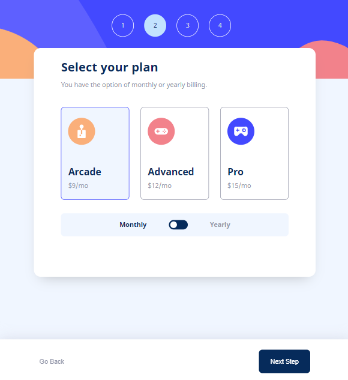

# Frontend Mentor - Multi-step form solution
## React + Vite + SASS

This is a solution to the [Multi-step form challenge on Frontend Mentor](https://www.frontendmentor.io/challenges/multistep-form-YVAnSdqQBJ).

## Table of contents

- [Overview](#overview)
  - [The challenge](#the-challenge)
  - [Screenshot](#screenshot)
  - [Links](#links)
- [My process](#my-process)
  - [Built with](#built-with)
  - [What I learned](#what-i-learned)
  - [Useful resources](#useful-resources)
- [Author](#author)


## Overview

A preview of this project's challenges and my solution.

### The challenge

Users should be able to:

- Complete each step of the sequence
- Go back to a previous step to update their selections
- See a summary of their selections on the final step and confirm their order
- View the optimal layout for the interface depending on their device's screen size
- See hover and focus states for all interactive elements on the page
- Receive form validation messages if:
  - A field has been missed
  - The email address is not formatted correctly

### Screenshot

Preview of my solution in different layouts.

#### Desktop view


#### Tablet view



#### Mobile view


### Links

- Solution URL: [FEM-multi-step-form-project](https://github.com/Sarah-okolo/FEM-multi-step-form-project)
- Live Site URL: [multi-step-form-by-sarah-okolo](https://multi-step-form-by-sarah-okolo.netlify.app/)


## My process

In this section, I highlight the process I followed to building out my solution for this challenge.

### Built with

- [React JS](https://reactjs.org/) - JS library
- [Sass and SCSS](https://sass-lang.com/) - For styles
- [Vite](https://vitejs.dev/) - Frontend development server
- Flexbox
- CSS Grid

### What I learned

Through this challenge, I learned about the following useful practices, tools, techniques, and frameworks for front-end development.

#### React

This is my first React project. This challenge gave me an opportunity to learn how to use the React JS framework to build webpages. The challenge presented me with enough tasks to learn a lot about React features such as Virtual DOM, Components, JSX, Hooks, Updater functions, Props, Event handling, Prop types, and more...

#### Sass and SCSS

It was also my first time using Sass in a project. I have always preferred having full control over my styling rather than using a CSS framework or library. But I also wanted to make use of certain features that native CSS does not have, which led me to learn about how to make use of a CSS preprocessor instead, through my research I was able to publish [this article](https://www.frontendmentor.io/articles/css-preprocessors-sass-or-less-which-to-choose-JOI20I1xNL) about CSS preprocessors, and I found Sass to be the best option. I learned about amazing Sass features such as the indentation syntax, `@import` rule, compiling a Sass file to CSS, `@mixin` rule, Nestng, `@include` rule, Variables, Functions, conditional styling with `@if` and `@else` rule, and the **SCSS** block syntax. 

#### Vite

Deciding to build out my solution for this challenge with React required me to learn about how to create a React project with the Vite development server and how to run builds for my project. While learning Vite, I was able to get a very good understanding of [Hot Module Replacement (HMR)](https://vitejs.dev/guide/features.html#hot-module-replacement).

#### Techniques and Code

In this section, I list out a few techniques I am proud that I got to learn about while building out this solution.

- How to create a custom checkbox:
```html
<div role="checkbox" id="checkbx" tabIndex="0" aria-checked="false">
  <ion-icon name="checkmark-sharp" className="checkmark"></ion-icon>
</div>
```

- How to extract a numbers from a string:
```js
function extractNumericValues(AlNmStr) {
  const numericValues = AlNmStr.match(/\d+/g).join("");
  return Number(numericValues);
}
```

- How to update styles conditionally from a JS variable
```jsx
<p className='payment-time-frame' style={isMonthOrYear == "mo" ? {color: 'hsl(231, 11%, 63%)'} : {color: 'hsl(213, 96%, 18%)'}}>Monthly</p>
```

### Useful resource

- [React Tutorial](https://www.youtube.com/playlist?list=PLZPZq0r_RZOMQArzyI32mVndGBZ3D99XQ) - This helped me understand how to create a react application and how to make use of React State, Context, Ref, and Effect.


## Author

- Website - [Sarah Okolo](https://sara-okolo.netlify.app/)
- Frontend Mentor - [@Sarah-okolo](https://www.frontendmentor.io/profile/Sarah-okolo)
- Twitter - [@SahraOke](https://x.com/SahraOke)
